# ThesisFlow

[](https://github.com/nathzramirez0-sys/ThesisFlow/actions/workflows/ci.yml)

A thesis and group-project manager for college students in the Philippines. A thesis group, usually three to five students and an adviser, sees in one place who is doing what, which chapters are done, what the adviser said about the latest draft, and how many days are left before the defense.

It's a native Android app written in Kotlin and Jetpack Compose. It works offline, and Firebase security rules enforce each role's permissions on the server.

<p align="center">
  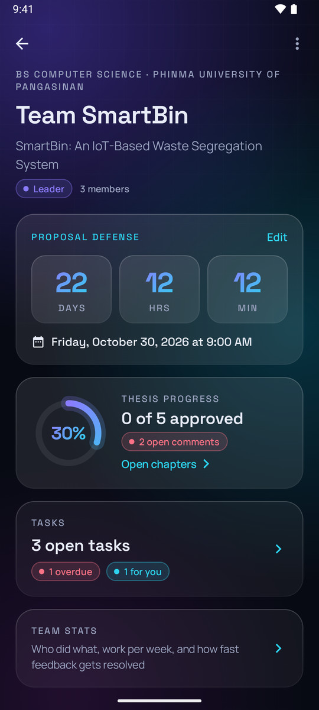
  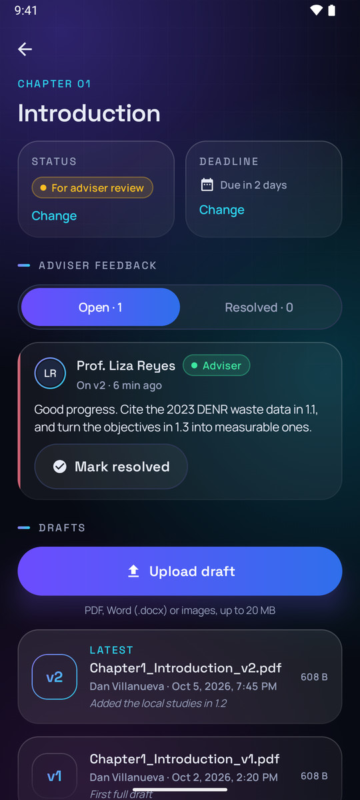
  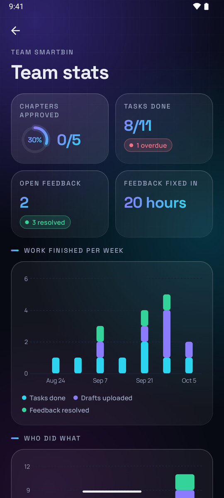
</p>

## Features

**For every group**
- **Chapter tracker.** Every chapter has a status (Not started → Drafting → For adviser review → Revisions → Approved), a deadline and a full draft history. Uploading a draft creates v1, v2, v3… and older versions stay available to open.
- **Adviser feedback.** The adviser comments on a specific draft and can send the chapter back for revisions in the same step. The group marks each comment resolved, and resolved comments move to their own tab.
- **Tasks.** A list view and a kanban board (To do / In progress / Done), with priorities, due dates, assignees, a linked chapter, file attachments and a comment thread.
- **Activity feed.** One timeline of what happened: drafts uploaded, chapters moved, feedback posted and resolved, tasks finished, members joined.
- **Defense countdown.** Days, hours and minutes to the proposal and final defenses, shown on the group and in the group list.
- **Team stats.** Chapters approved, tasks done and overdue, how fast feedback gets resolved (the median), work finished per week over the last 8 weeks, and what each member contributed.
- **Notifications.** Push notifications for feedback, reviews, approvals, new tasks and new members. A daily reminder lists what's due soon or overdue; it's worked out on the phone, so it also works offline.
- **Invites.** The leader shares a 6-character code or a `https://…/join/CODE` link. Codes expire after 7 days, and a group holds up to 10 people.

**What each role can do** (enforced by the security rules, not just hidden in the UI)

| | Leader | Member | Adviser |
|---|:-:|:-:|:-:|
| Edit the group, defense dates and roles; invite and remove people | ✔ | | |
| Add, rename and delete chapters; set deadlines | ✔ | | |
| Upload drafts | ✔ | ✔ | |
| Move chapter status | ✔ | ✔ (not to or from Approved) | ✔ |
| Approve a chapter | ✔ | | ✔ |
| Post feedback, with marked-up files | | | ✔ |
| Resolve feedback | ✔ | ✔ | ✔ |
| Create, edit, assign and delete tasks | ✔ | | |
| Move a task between columns | ✔ | only their own | |
| Comment on tasks | ✔ | ✔ | ✔ |

## Screenshots

| | | |
|:-:|:-:|:-:|
| 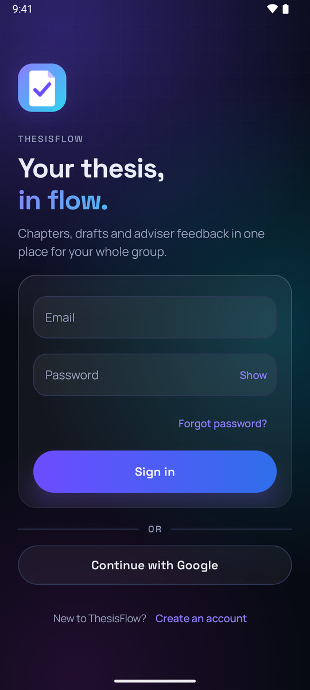 | 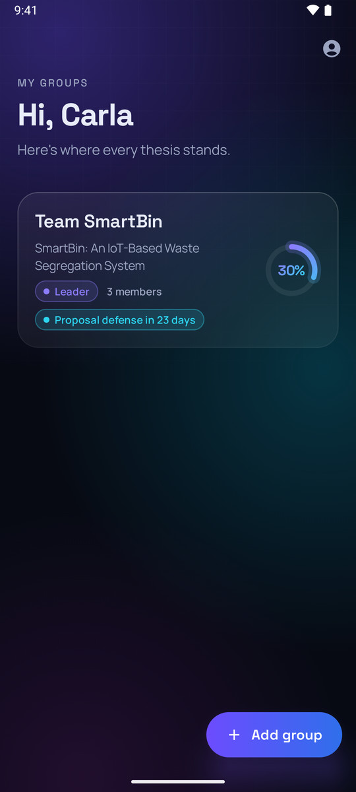 |  |
| Sign in (email or Google) | My groups | Group overview with defense countdown |
| 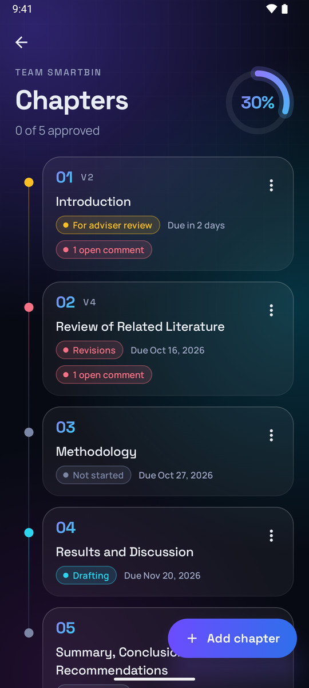 |  | 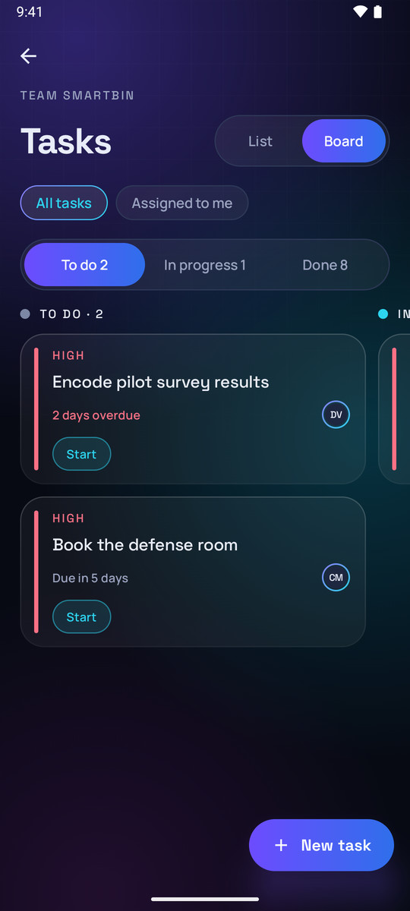 |
| Chapter timeline | Adviser feedback and draft versions | Kanban task board |
| 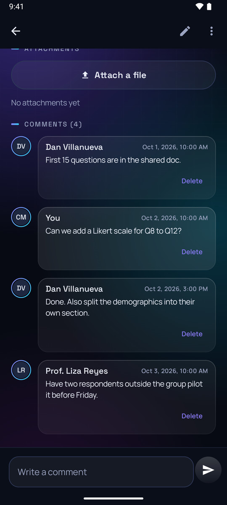 | 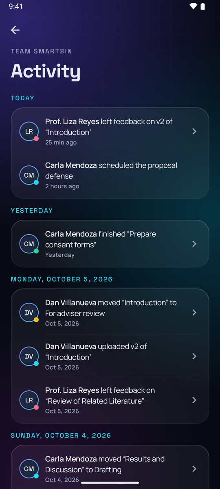 |  |
| Task discussion | Activity feed | Team stats |
| 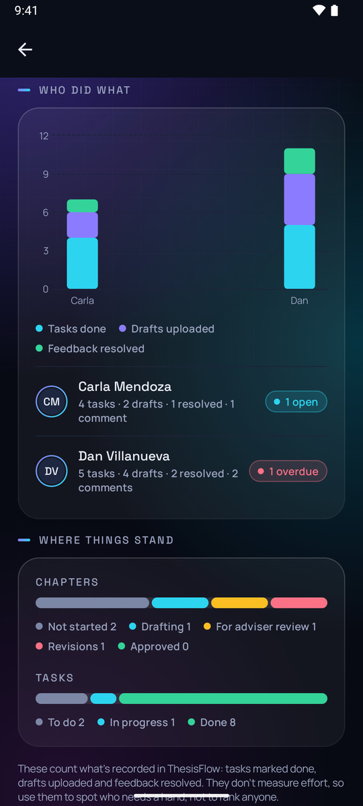 | 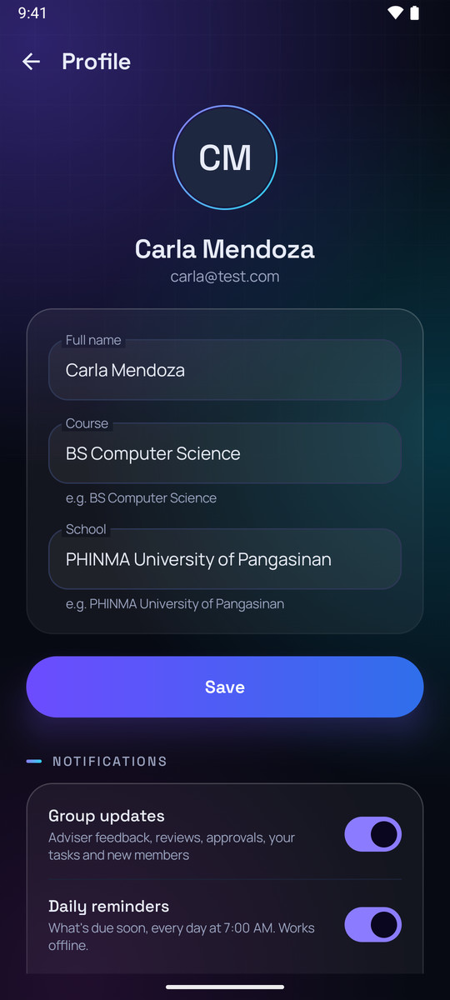 | 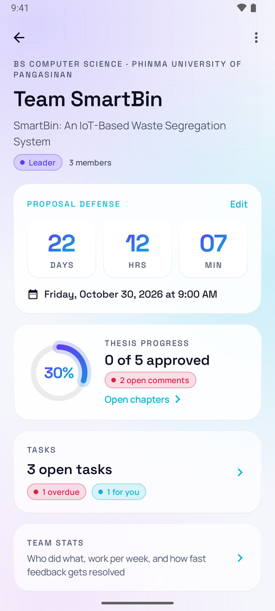 |
| Contributions per member | Profile and notification settings | Light theme |

The design system is a custom "aurora glass" theme: a dark-first deep-space background with violet and cyan glows, translucent cards, gradient buttons and a glowing progress ring. It's built on Material 3 components, uses Space Grotesk and Manrope, and has a matching light theme.

## Tech stack

| | |
|---|---|
| Language and UI | Kotlin, Jetpack Compose, Material 3, Navigation Compose |
| Architecture | MVVM + Clean Architecture in three Gradle modules, Hilt (with assisted injection), Coroutines and Flow |
| Local data | Room (the app's read model, schema-versioned with auto-migrations), DataStore for device settings |
| Background work | WorkManager: resumable file uploads and the daily reminder |
| Backend | Firebase Auth (email and Google via Credential Manager), Cloud Firestore, Cloud Storage, Cloud Functions (TypeScript), Cloud Messaging, Hosting (invite links) |
| Charts | Vico |
| Testing | JUnit, MockK, Turbine, Room `MigrationTestHelper`, `@firebase/rules-unit-testing` on the Firebase emulators |
| CI | GitHub Actions: unit tests and a debug build, security-rule tests, Cloud Functions build |

## Architecture

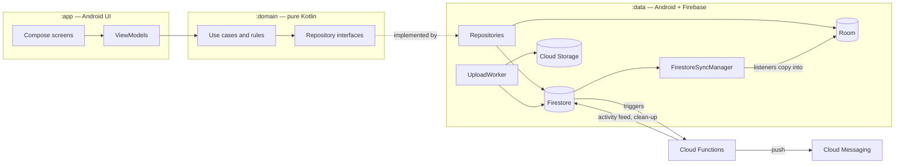

| Module | What it holds |
|---|---|
| `domain/` | Pure Kotlin/JVM: models, validation, the permission rules (`ChapterRules`, `TaskRules`, `FeedbackRules`), use cases and repository interfaces. It has no Android or Firebase imports, so all of it is tested on the JVM. |
| `data/` | Room entities and DAOs, Firestore mapping, repositories, the sync manager, the upload worker, push-token registration and settings. |
| `app/` | Compose screens, ViewModels, navigation, notifications, the reminder worker and the design system. |
| `functions/` | Callables (`createInvite`, `joinGroup`, `deleteGroup`), triggers that write the activity feed and send pushes, clean-up of deleted chapters, tasks and feedback, and `syncMemberProfiles`. |
| `firestore.rules`, `storage.rules` | The server-side copy of the permission table above, plus field validation. |
| `rules-tests/` | 59 tests that run those rules against the Firebase emulators. |

## Key decisions

**Room is the only thing the UI reads.** Screens observe Room through Flow. While the app is in the foreground, `FirestoreSyncManager` keeps Firestore listeners open for the user's groups and copies every change into Room. Every screen therefore renders instantly from disk, works the same online and offline, and comes from a single source, so no screen merges two. Snapshots served from Firestore's cache only add rows; only server snapshots may delete them. That stops a stale cache from wiping data the server still has.

**Writes go to Firestore, which queues them offline.** Firestore's offline persistence already queues writes and replays them when the phone reconnects. A write waits a few seconds for the server, then is treated as queued, and the UI shows a "waiting to sync" marker from the document's pending-writes flag. Building a second outbox on top would only duplicate that.

**Files are the exception.** Cloud Storage has no offline queue, so an upload is first copied into app storage and recorded in a Room table (`pending_uploads`). A WorkManager job then sends it with retries and backoff, and it survives the app being killed. A draft's version number comes from a Firestore transaction, so two members uploading at once get v3 and v4, never two v3s. Because that table holds files that exist nowhere else yet, schema changes use Room auto-migrations, and an instrumented test runs every migration with a queued upload in the table.

**Permissions live in two places on purpose.** The domain rules (`ChapterRules`, `TaskRules`, `FeedbackRules`) decide which buttons the UI shows. `firestore.rules` and `storage.rules` enforce the same table on the server, because a modified app could ignore the UI. The rules tests make sure the server copy does what the table says.

**Some writes are server-only.** Joining a group goes through a callable function: a non-member can't read the group, and letting clients add themselves to `memberIds` would let anyone join any group. The activity feed is written only by Firestore triggers, so the app can't forge an entry. Each trigger takes the actor from a field the rules force to be the writer (`updatedBy`, `uploadedBy`, `authorId`), and uses the trigger's event ID as the document ID, so a retried trigger can't post an entry twice. A TTL policy deletes entries after 180 days.

**Reminders are worked out on the phone.** A pure `ReminderPlanner` decides what's overdue, due today, due tomorrow or due soon. A daily WorkManager job runs it against Room, and a `sent_reminders` table makes sure each reminder fires only once. Reminders therefore work offline and need no server cron job. Pushes for things other people did are data-only FCM messages that carry their recipient, and the phone drops any push meant for someone else (for example, after the user switches accounts).

**Stats count records, not effort.** The dashboard counts what ThesisFlow can see: tasks done, drafts uploaded, feedback resolved. Members are listed by name rather than ranked, and the screen says the numbers don't measure effort. Feedback turnaround uses the median, so one comment ignored over a semester break doesn't distort it.

**ViewModels that take a route use assisted injection.** `SavedStateHandle.toRoute()` needs Android's `Bundle`, so a ViewModel that read its route that way couldn't be tested on the JVM. Hilt's assisted injection passes the route in as an object instead, so tests just construct it.

## Security model

- A user can read and write only their own profile, and only data in groups whose `memberIds` include them. Collection-group queries (all versions, comments or feedback at once) must filter on `groupId`, which lets the rules check membership.
- Every create and update is validated: allowed keys, types, lengths (matching `Validators.kt`), server timestamps, and the writer's own UID in `createdBy` / `updatedBy` / `authorId`.
- A group always keeps at least one leader. Members can remove only themselves, and nobody can add members except through `joinGroup`.
- Drafts and version history can't be edited or deleted from the app. Leaders can remove task attachments, but never an adviser's feedback files.
- Storage rules read the group from Firestore. Uploads are limited to PDF, Word or images up to 20 MB, must carry the uploader's UID, and only advisers upload feedback files.
- Invite codes live in a collection the app can't read, so codes can't be listed or guessed through the client SDK.

## Offline behaviour

- Everything already synced can be read offline: groups, chapters, drafts already opened, tasks, comments, feedback, activity and stats.
- Changes made offline (moving a chapter or task, creating a task, commenting, resolving feedback) show up immediately with a "waiting to sync" marker. They're sent when the phone reconnects, even after a restart.
- Drafts and attachments picked offline wait in the upload queue and go up on their own once there's a connection.
- A banner at the top says when the phone is offline. Joining a group, creating invites and deleting a group need a connection, and the app says so.

## Testing

| Suite | What it covers | Run with |
|---|---|---|
| Unit tests (138) | Domain rules, validation, the reminder planner, stats, use cases, activity and push-payload parsing and the upload file store in `:data`, and ViewModels (with MockK and Turbine) | `./gradlew test` |
| Room migrations (2) | Every schema from v1 to the latest, checked against the exported schemas, with a queued upload surviving the whole chain | `./gradlew :data:connectedDebugAndroidTest` (needs a device or emulator) |
| Security rules (59) | Every collection the app writes, using the same fields, batches and server timestamps as the repositories, plus Storage uploads and deletes | `cd rules-tests && npm install && npm test` (needs Java 21+; starts and stops the Firestore and Storage emulators) |

CI runs the unit tests, a debug build, the rules tests and the Cloud Functions build on every push and pull request.

## Run it locally (no Firebase project needed)

The debug build can talk to the Firebase Local Emulator Suite using a demo config with placeholder values. You need Android Studio, Node 22+ and Java 21+.

1. Copy the demo config into place:

   ```bash
   cp app/google-services.emulator.json app/google-services.json
   ```

2. Build the functions and start the emulators:

   ```bash
   npm --prefix functions install && npm --prefix functions run build
   ```

   ```bash
   npx firebase-tools emulators:start --project demo-thesisflow
   ```

3. Install the app on an Android emulator, pointed at the local emulators (it reaches your computer at `10.0.2.2`):

   ```bash
   ./gradlew :app:installDebug -Pthesisflow.useEmulators=true
   ```

Email sign-up works against the emulators. Google sign-in and push notifications need a real project; FCM has no emulator, so the Functions emulator logs each push and its recipients instead of sending it. Daily reminders are worked out on the phone and work against the emulators.

## Use a real Firebase project

1. Create a project on the **Blaze** plan (Cloud Storage needs it) and put Firestore in `asia-southeast1`.
2. Add an Android app with the package `com.nathzramirez.thesisflow` and your debug SHA-1 (`./gradlew signingReport`). Enable **Email/Password** and **Google** sign-in, then download `google-services.json` into `app/`.
3. Point the CLI at the project and deploy:

   ```bash
   npx firebase-tools use --add
   ```

   ```bash
   npx firebase-tools deploy --only firestore,storage,functions,hosting
   ```

   The Firestore deploy also turns on the TTL policy (in `firestore.indexes.json`) that deletes activity entries after 180 days.

4. For invite links, set `thesisflow.inviteHost` in `gradle.properties` to your `<project-id>.web.app` domain, and put your signing certificate's SHA-256 in `hosting/public/.well-known/assetlinks.json`.

## Credits

Fonts: [Space Grotesk](third_party/fonts/SpaceGrotesk-OFL.txt) and [Manrope](third_party/fonts/Manrope-OFL.txt), both under the SIL Open Font License.
